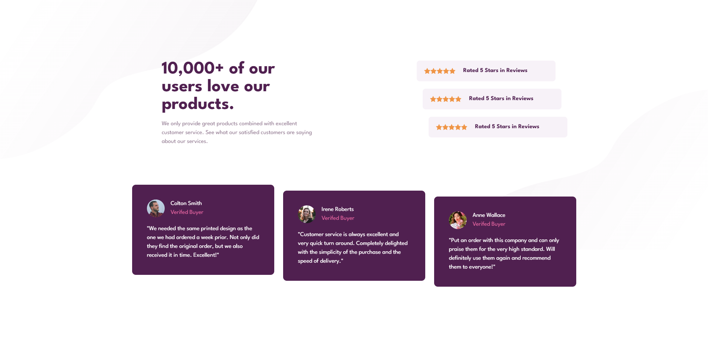

# Social Proof Section

## A responsive UI component highlighting user testimonials and ratings

This project implements a social proof section that displays customer trust indicators through ratings and testimonials. The layout consists of three star-rating summaries and three testimonial cards, arranged to create visual hierarchy and depth.

The component focuses on responsive layout techniques, spacing control, and reusable UI structure while maintaining a clean and readable design across different screen sizes.

### Screenshots

#### Image of the Desktop Design

#### Image of the Mobile Design

### Layout & Spacing Explanation (Index-Based Positioning)
Insted of hardcoding positions for each card, the components are rendered using .map(), and conditional spacing is applied
depending on the current index: 

style={{"--ml": `${index + 1.5}rem`} as React.CSSProperties} 

### Built with

- [React](https://react.dev/) - JS library
- [TypeScript](https://www.typescriptlang.org/) - type superset of JS
- [Tailwindcss](https://tailwindcss.com/) - utility-first CSS framework

## Author

- Website - [Mihailo Djurovic](portfolio-miahilo.vercel.app)

